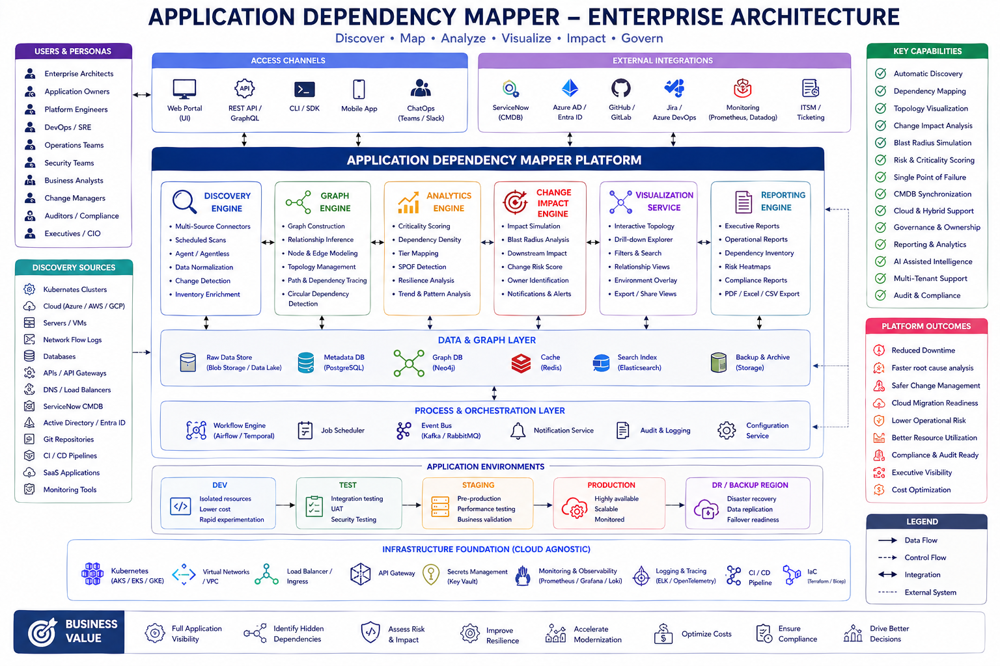
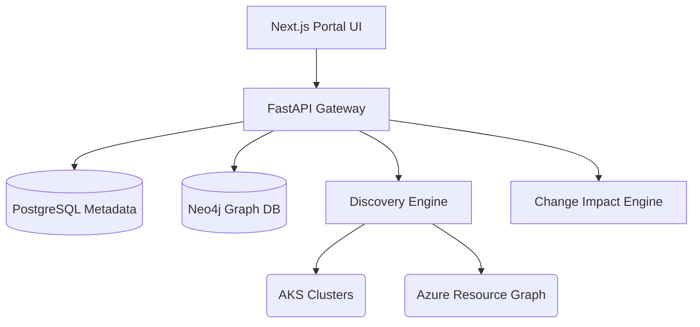
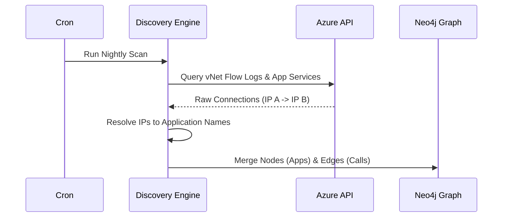
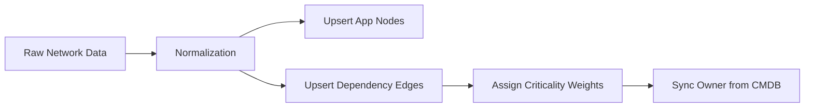
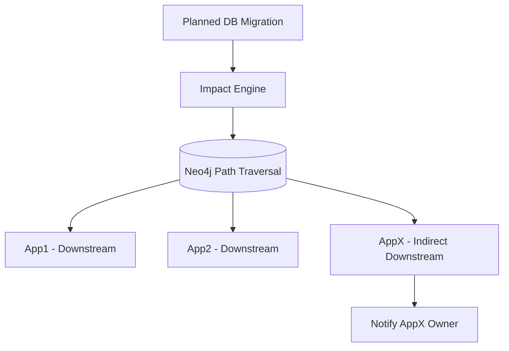
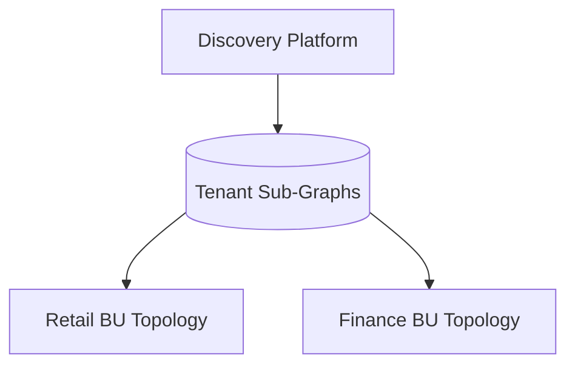
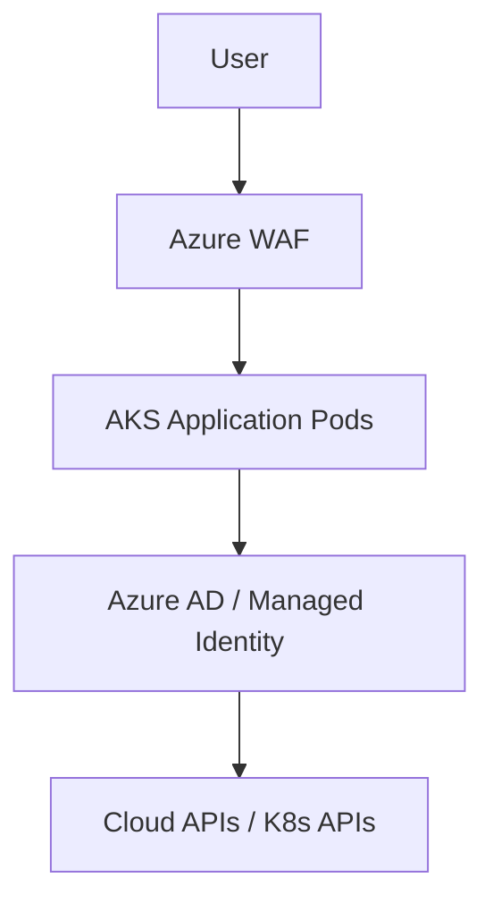
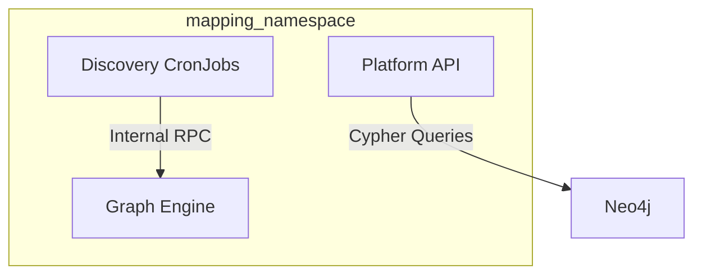
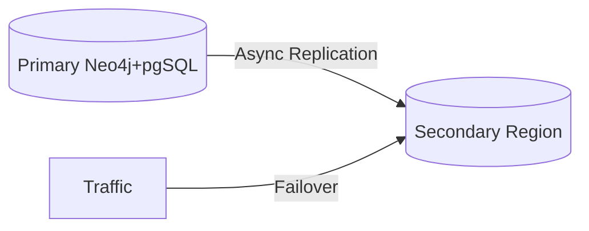

<div align="center">


<h1>Application Dependency Mapper</h1>

<p><strong>Enterprise Graph Analytics & Auto-Discovery for Service Interactions and Blast Radius Simulations</strong></p>

[](https://devopstrio.co.uk/)
[](/terraform)
[](/apps/graph-engine)
[](https://devopstrio.co.uk/)

</div>

---

## 🏛️ Executive Summary



The **Application Dependency Mapper (ADM)** is a flagship graph-analytics platform engineered to eradicate "hidden dependencies" in the enterprise. By autonomously scanning networks, codebases, and APIs, ADM constructs a real-time logical topology of how every system interacts.

### Strategic Business Outcomes
- **Blast Radius Simulation**: Instantly predict which downstream applications will crash if a specific database or API goes offline.
- **Microservice Visualizations**: Automatically map the complex mesh of Kubernetes pods, Cloud databases, and Legacy monoliths without manual CMDB entry.
- **Migration Intelligence**: Identify "tightly coupled" systems prior to cloud migrations, ensuring entire dependency chains are moved simultaneously.
- **Single Point of Failure (SPOF) Detection**: Run graph traversals to find centralized services lacking redundancy.

---

## 🏗️ Technical Architecture Details

### 1. High-Level Architecture


### 2. Auto-Discovery Workflow


### 3. Graph Build Lifecycle


### 4. Change Impact Analysis Flow (Blast Radius)


### 5. Multi-Tenant Model


### 6. Security Trust Boundary


### 7. AKS Workload Topology


### 8. Disaster Recovery Topology


---

## 🛠️ Global Platform Engines

| Engine | Directory | Purpose |
|:---|:---|:---|
| **Portal UI** | `apps/portal/` | Interactive React graph visualizer and executive dashboard. |
| **Platform API** | `apps/api/` | Gateway orchestrating searches and impact simulations. |
| **Discovery Engine**| `apps/discovery-engine/`| Agents interacting with Azure/AWS/K8s to extract topology. |
| **Graph Engine** | `apps/graph-engine/` | Translates raw network flows into semantic Neo4j Cypher data. |
| **Impact Engine** | `apps/change-impact-engine/`| Executes path traversal to calculate blast radius percentages. |

---

## 🚀 Deployment

Provision the foundation utilizing the Bicep templates.

```bash
cd bicep
az deployment sub create --name adm-platform --location uksouth --template-file main.bicep
```

---
<sub>&copy; 2026 Devopstrio &mdash; Illuminating the Enterprise Architecture.</sub>
